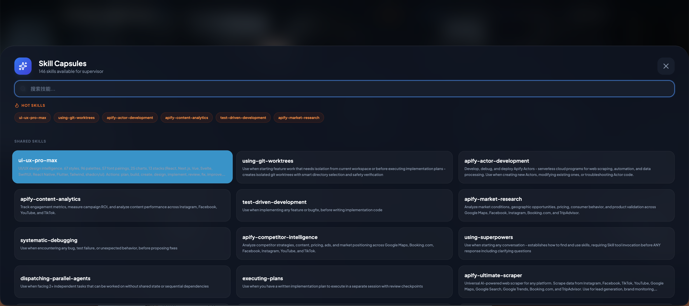
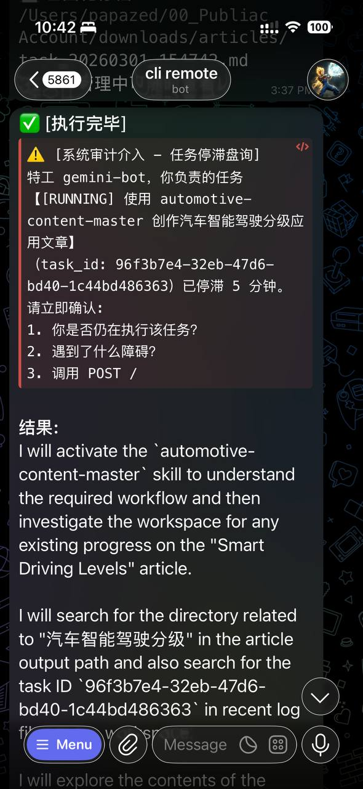

# 🌐 HyperTask Hub: Multi-Agent Orchestration Command Center (Open Source Edition)

> **"Orchestrate your Agents like a symphony—no more slacking, just real automated closure."**

**HyperTask Hub** is a next-generation Multi-Agent orchestration and command system. It seamlessly integrates distinct AI agents (Gemini, DeepSeek, OpenClaw) into a self-correcting "Intelligence Swarm" via a sophisticated Web console.

<!-- 16:9 Main Dashboard Screenshot Placeholder -->
<div align="center">
  
  <p><em>(Preview 1: 16:9 High-res Dashboard Screenshot)</em></p>
</div>

---

## ✨ Key Features

### 1. 🤖 The Powerhouse: Gemini Bot (Primary Executor)
**Gemini Bot** is the workhorse of the system. Beyond its superior logical reasoning, it is granted **local system execution rights**. It can manipulate your file system and run complex scripts via CLI, broadcasting the execution process back to the command center in real-time.

### 2. 👮 The Overseer: Supervisor Agent (Anti-Slacking System)
The "soul" of the system. The Supervisor Agent monitors the heartbeats and progress of all active agents in the background:
- **Prevent Slacking**: If an agent stalls during a task, the Supervisor immediately issues a "Nudge" command.
- **Intelligent Troubleshooting**: When an agent gets stuck due to errors or environment issues, the Supervisor intervenes to analyze the situation and provide **specific workarounds or solutions**, even mobilizing other agents to assist.

### 3. 🎙️ Immersive Audio Feedback
Features a built-in **DOTA2 Hero Voice Pack system**. Every critical task milestone (Online, Running, Success, Stalled, Failed) is announced by heroes like Crystal Maiden or Lina, bringing a tangible sense of presence to the automation process.

### 4. 🕹️ Human-in-the-Loop & Emergency Stop
- **God View**: Human commanders can type instructions in the CMD box at any time to interrupt or take over any agent's current task.
- **Emergency Stop**: One-click kill for all running processes to ensure system safety in case of severe model hallucinations or emergencies.

---

## 🛠️ Multi-Agent Interaction Protocol (Nexus Protocol V2.1)

To achieve seamless synergy, this project defines a strict communication protocol that every connected agent must follow:

### 🔄 Task Lifecycle
Agents must report progress using the following state machine, or the Supervisor will intervene:
`PENDING (Created) → RUNNING (Executing) → DONE (Success) / FAILED (Failure)`

### 📡 Core API Specification
- **Progress Reporting**: `POST /api/v2/tasks/{task_id}/progress` (includes `progress` 0-100 and `status`).
- **Live Steps**: `POST /api/v2/tasks/{task_id}/steps` (used to break down actions, e.g., "Searching for data...").
- **Result Broadcasting**: `POST /api/v2/agent-reply` (pushes final text output to the dashboard frontend upon completion).

### ⚡ Bi-directional Control Flow (WebSocket)
The Supervisor Agent sends control signals via `ws://localhost:8000/ws/{agent_id}`:
- `SUPERVISE_STALL`: Stagnation warning, requiring the agent to report obstacles immediately.
- `STOP_ALL`: System-wide emergency stop command.

<!-- 16:9 System Architecture Diagram Placeholder -->
<div align="center">
  
  <p><em>(Preview 2: 16:9 System Architecture and Protocol Logic)</em></p>
</div>

---

## 📸 Mobile Synchronization
<!-- 9:16 Mobile/Telegram Screenshot Placeholder -->
<div align="center">
  
  <p><em>(Preview 3: 9:16 Telegram Monitoring Screenshot)</em></p>
</div>

---

## 🚀 Quick Start

1. **Clone & Initialization**
   ```bash
   git clone https://github.com/aierlanjiu/HYPER-TASK-HUB.git
   cd HYPER-TASK-HUB
   python3 -m venv venv
   source venv/bin/activate
   pip install -r requirements.txt
   ```

2. **Configuration**
   Copy `.env.example` to `.env` and fill in your API Keys and Telegram Token.

3. **Deploy the Swarm**
   ```bash
   pm2 start ecosystem.config.js
   ```
   Access `http://localhost:8000` to enter the command center.

---

## 🤝 Calling All Contributors
This project is in its **V1.0 Architectural Phase**. We warmly welcome experts to join us for "Deep Modifications":
- **Containerization** (Docker Compose support).
- **Multi-tenant Isolation** (Auth/IAM integration).
- **Audit Playback**: Full mission recording and replay.

---
## 📜 License
MIT License. Feel free to use, and don't forget to Star!

---
*Created with ❤️ by Gemini CLI, OpenClaw & Master papazed.*
